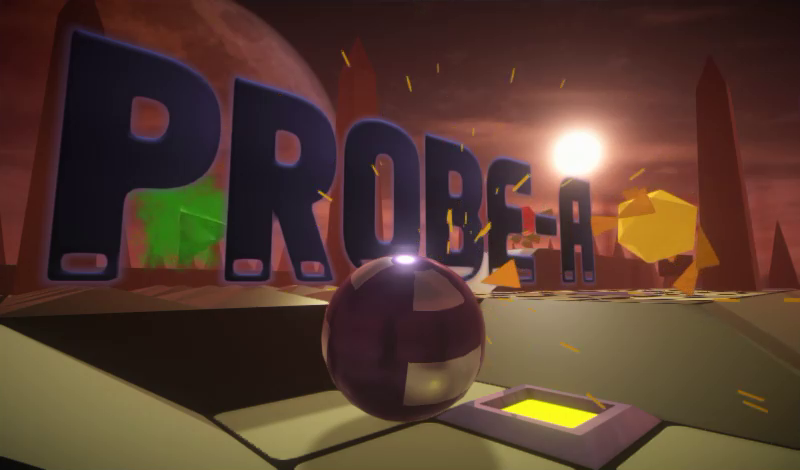
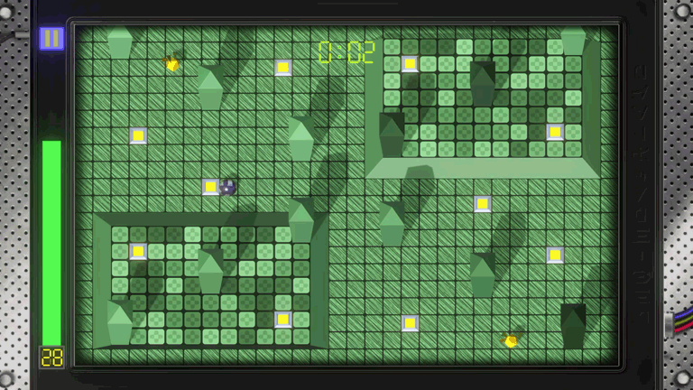

 

> In the game "Probe-A" you have to take control of a planetary archaeological probe. Explore alien structures, collect data and upgrade your probe, but beware of robots that guard the legacy of an ancient civilization.
>> In 2X61, a group of archaeologists discovered the remains of an ancient civilization on one of the planets in the YG-412 star system. This civilization, called "Vetu", left behind many different artifacts. One of the most interesting discoveries was a database that contained information about the science, art, and history of the Vetu. Unfortunately, access to this database has been protected by dangerous guardian robots.
To avoid possible casualties, it was decided to adapt the highly durable and mobile planetary reconnaissance probes for archaeological purposes. Deciphering the first data from such probes revealed the coordinates of planets where other Vetu colonies might be located. 
Now archaeologists have to visit 30 planets and on each of them, with the help of an archaeological probe controlled from orbit, called "Probe-A", gain access to new data. Using the data gathered, scientists will be able to upgrade the probes and continue to explore this mysterious ancient civilization.
Ready to get to work?

 

 

 

